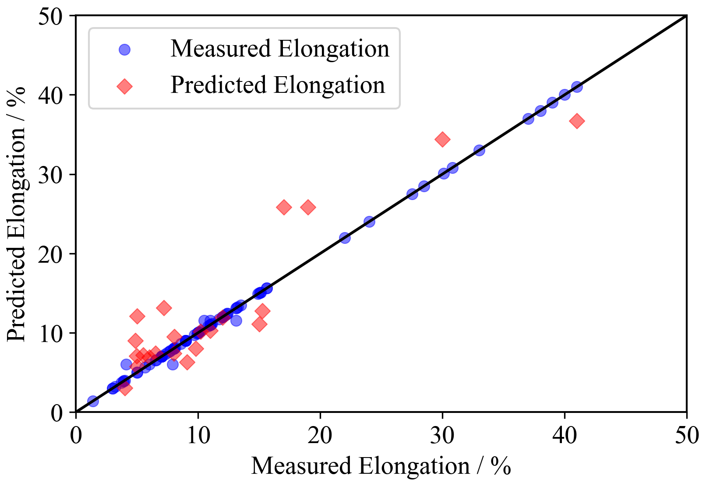

# Machine_learning_based_prediction_of_the_mechanical_properties_of_b_titanium_SMAs
This is a machine learning work which attempts to predict the mechanical properties of b titanium shape memory alloys.
Several models were implemented using sckit-learn and the data were collected by references down below.

## Overview

### Models
* Linear regression
* Random forest regression
* Support vector regression
* Gradient boost regression

### Evaluation metrics
R2 score, MSE, and RMSE were used in this work.

### Implementation

The image above shows the comparison between the values indicated in the articles and the values predicted by the model. 
The data was divided between training set and test set.

### Dependencies 
This work dependes on the following libraries:
* jupyterlab 3.0.10
* Numpy 1.21.1
* Matplotlib 3.3.4
* scikit-learn 0.24.2
* seaborn 0.11.1

Also, this code should be compatible with Python versions 2.7-3.7.

### Reference
[1] Kim, H.Y., Hashimoto, S., Kim, J.I., Hosoda, H. and Miyazaki, S., 2004. Mechanical properties and shape memory behavior of Ti-Nb alloys. materials Transactions, 45(7), pp.2443-2448.  
[2] M. Murata. (2020). Ti-Nb-Al三元系を用いた超弾性特性の合金設計のための実
験的検討 . Tokyo Institute of Technology.  
[3] K. Kimura. (2017). Ti-Mo-Al 生体用形状記憶合金の相構成と機械的性質 . Tokyo Institute of Technology.  
[4] Kim, J.I., Kim, H.Y., Inamura, T., Hosoda, H. and Miyazaki, S., 2005. Shape memory characteristics of Ti–22Nb–(2–8) Zr (at.%) biomedical alloys. Materials Science and Engineering: A, 403(1-2), pp.334-339.
[5] Cui, Y., Li, Y., Luo, K. and Xu, H., 2010. Microstructure and shape memory effect of Ti–20Zr–10Nb alloy. Materials Science and Engineering: A, 527(3), pp.652-656.
[6] Zhang, J., Sun, F., Hao, Y., Gozdecki, N., Lebrun, E., Vermaut, P., Portier, R., Gloriant, T., Laheurte, P. and Prima, F., 2013. Influence of equiatomic Zr/Nb substitution on superelastic behavior of Ti–Nb–Zr alloy. Materials Science and Engineering: A, 563, pp.78-85.
[7] T. Akutsu. (2016). Ti-Cr-Sn 生体用形状記憶合金の相構成と機械的性質 . Tokyo Institute of Technology.
[8] Wadood, A., Inamura, T., Yamabe-Mitarai, Y. and Hosoda, H., 2013. Comparison of bond order, metal d orbital energy level, mechanical and shape memory properties of Ti–Cr–Sn and Ti–Ag–Sn alloys. Materials transactions, 54(4), pp.566-573.
[9] Y. Zhou (2016). Influence of aging treatment on superelasticity and mechanical properties of Ti-Nb-Sn shape memory alloys. Tokyo Institute of Technology.
[10] S. Iwasaki. (2017). Ti-Cr-Al形状記 憶合金の機械的特性に及ぼす Crと Alの影
響 .Tokyo Institute of Technology.
[11] R. Hayakawa (2013). 時効処理を施した Ti-Mo-Al-Ze合金の相と力学特性 . Tokyo Institute of Technology.
[12] Hall, M.A. and Smith, L.A., 1999, May. Feature selection for machine learning: comparing a correlation-based filter approach to the wrapper. In FLAIRS conference Vol.
- 39 -
1999, pp. 235-239.
[13] Williams, J.C., Hickman, B.S. and Leslie, D.H., 1971. The effect of ternary additions on the decompositon of metastable beta-phase titanium alloys. Metallurgical Transactions, 2(2), pp.477-484.
